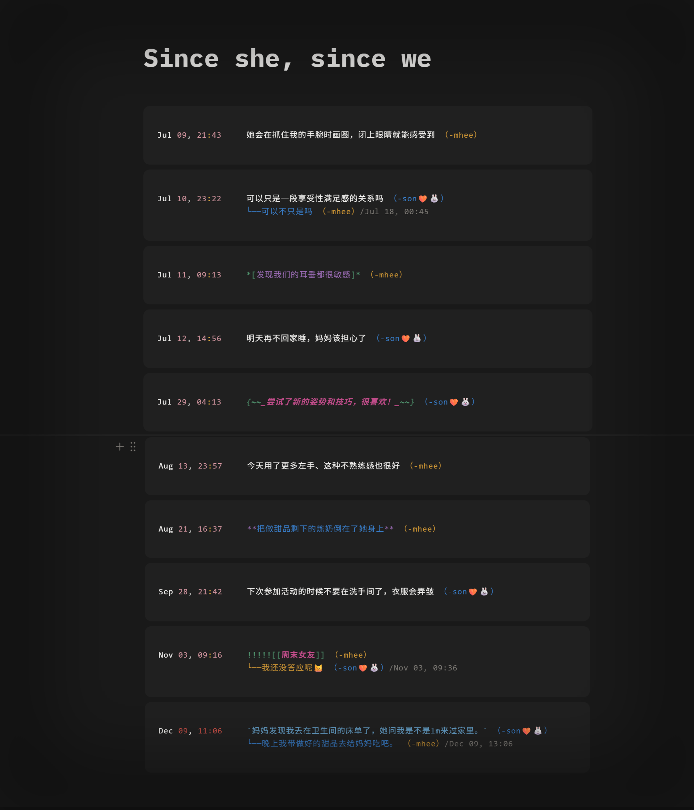
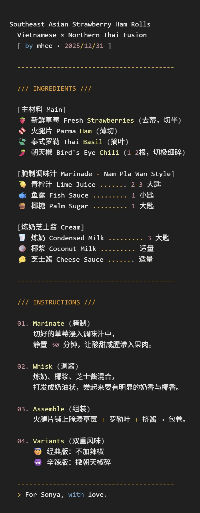

# /// intimate rehearsals ///
> a fan-written novel in progress  
> writes intimacy as something practiced


[](https://github.com/ele-eleph-elephant/intimate-rehearsals#content-warning)
[](LICENSE)

---

**"所谓的练习—intimate rehearsals,  
是她们从拍摄爱情诡计时期就开始的固定活动,  
每周一至两次，为了保证拍摄亲密戏份时的默契娴熟。  
然而非拍摄时期也这样心照不宣的维持了下来。"**

---

## STATUS
```
┌────────────────────────────────────────┐
│ [In Progress] 3/? chapters completed   │
│ Last Update: 2026.02.10                │
│ Current Word Count: ~18k words         │
└────────────────────────────────────────┘
```

---

## > DIRECTORY: ./LMSY/Fanfiction/
```
├── Ch.01  「情欲实践」
├── Ch.02  「热带病」
└── Ch.03  「向晚的高处」
```

---

## 🔗 Read Online / 在线阅读

📚 **AsianFanFics**: [asianfanfics.com/story/view/1686737](https://www.asianfanfics.com/story/view/1686737)

---

## 🎨 Visual Assets / 视觉资料

### Chapter 02: 热带病 - 共享文档



---

### Chapter 03: 向晚的高处 - tapas食谱

<div align="center">
  
</div>

---

## 🏷️ Tags / 标签
```
#erotic_fanfiction  
#身体叙事  #非线性叙事  #空间化叙事
#situationship  #friends_to_lovers(?)  
#ambiguous_relationship_dynamics  #emotional_intensity  
#sensual_geography  #female_perspective
#Bangkok_setting
```

---

## ⚠️ Content Warning / 内容警告
```
⚠️  R18 / Explicit Content
⚠️  Sexual content
⚠️  Emotional intensity & complex relationship dynamics
⚠️  Not suitable for minors / 未成年人不宜
```

---

## 📂 Repository Structure / 仓库结构
```
intimate-rehearsals/
├── README.md                   # 项目主页
├── LICENSE                     # CC BY-NC-SA 4.0
├── .gitignore                  
│
├── chapters/                   # 章节文本
│   ├── ch01_情欲实践.md
│   ├── ch02_热带病.md
│   └── ch03_向晚的高处.md
│
├── assets/                     # 资源文件
│   ├── images/                # 概念图/彩蛋
│   │   ├── ch02_shared_doc.png
│   │   └── ch03_tapas_recipe.png
│   │   
│   └── references/            # 参考资料（待编辑）
│       
│
└── notes/                      # 创作笔记（待编辑）
    
```

---

## > Author's Note
```
/*
 * 2025年10月开始关注 LMSY rps，一直在考古补档，断断续续写的，尽量保持更新。
 * 感谢阅读 ♡
 * 之后会在这个项目里持续更新相关的文本或其他，磕糖（造谣）灵感（误
 * 后续可能折腾一个专门的静态站点存放（鉴于很多平台的约束和不稳定
 */
```

---

## 💬 Feedback / 反馈

欢迎通过以下方式提供反馈：

- 💭 [GitHub Discussions](../../discussions) - 讨论剧情、角色、理论
- 🐛 [Issues](../../issues) - 报告错字、提出建议
- 📮 小红书 @ele_eleph_elephant

---

## 📜 License / 许可协议

本作品采用 [Creative Commons Attribution-NonCommercial-ShareAlike 4.0 International](LICENSE) 协议。

- ✅ 可以分享本作品
- ✅ 必须署名
- ❌ 不得用于商业用途
- ✅ 衍生作品需使用相同协议

详见 [LICENSE](LICENSE) 文件。

---

## ⚖️ Disclaimer / 免责声明
```
This is a work of fiction. 
All characters and events are fictional.
Any resemblance to real persons is purely coincidental.

本作品纯属虚构。
文中人物、事件均为虚构。
如与真实人物有任何相似之处，纯属巧合。
```

---

<div align="center">

**⭐ If you enjoy this work, please consider starring this repo ⭐**

*"以身处爱情之中，却活在爱情之外的方式。"*

*"高的低的丰盈与疏离，低的高的失序与欢愉*  
*长的短的渗透和黏连，短的长的回流和灼热"*

— Chapter 03「向晚的高处」

</div>

---

*Last updated: 2026.02.10*
